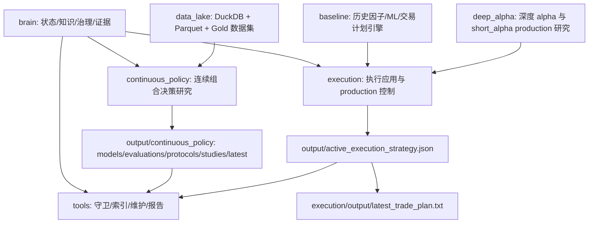

# daily_research 完整代码库检阅报告

日期：`2026-05-15`

检阅对象：`H:\new_tdx64\PYPlugins\user\daily_research`

检阅任务：完整代码库检阅、历史主线复盘、当前状态与未来行动边界分析。

## 0. 结论先行

### 事实
- `daily_research` 是当前工作区正式生产研究与执行主线；README 和 brain 均指向 `daily_research/brain/` 作为接管真源。
- 当前活跃执行物化真源是 `daily_research/output/active_execution_strategy.json`。
- 当前 live 默认执行 label 是 `short_expert_policy_v5b__regoff_k1_20d_ensemble_native_anchor__active`。
- 当前 effective live execution profile 是 `regoff_k1_20d_ensemble_native_anchor`。
- 当前 continuous_policy 仍是 `research / shadow_only`，不得替代 active 执行链。
- 当前有效 continuous_policy 研究基线仍是 r39 allocation objective consolidation；r40-r74 均为 research / shadow 升级链或基础设施证据。
- 当前 reusable training-safe Gold 数据集是 `continuous_policy_training_matrices__strict_train__36c234208d5f375ea1cccfc1`。
- `latest_*` 文件存在跨 tag 不同源风险：task capsule 报告 `latest_study_summary` 与 `latest_protocol_summary` 的 tag 不一致。
- 工作树在检阅开始时干净；`daily_research/output/active_execution_strategy.json` 无 diff。

### 推断
- 这个仓库不是单一模型工程，而是“研究、验证、执行、控制台、数据湖、脑区治理”合并的长期系统。
- 当前最重要的工程边界不是继续扩模型，而是维持 production anchor 与 continuous_policy research line 的隔离。
- 当前最大技术风险集中在 continuous_policy 的组合资金流语义、simulator 复杂度、profile/loss/version 边界、以及 latest 指针误用。
- 当前最大操作风险是把 smoke、dry-run、failed/interrupted trial、unit contract 或 latest summary 误写成 completed strategy evidence。
- 源码规模中等，但生成产物极重；任何接管者都必须把“源码检阅”和“产物证据检索”分开处理。

### 假设
- 本次任务是检阅与写回，不启动训练、评估、study 或 production refresh。
- 本报告不变更 live/default/promotion 结论。
- 本报告不替代 `state_center.md` 的当前状态，只作为可引用的完整代码库分析材料。

### 边界
- 禁止从本报告推出 promotion、strict resume、confirmatory 或 active artifact change。
- 禁止修改 `daily_research/output/active_execution_strategy.json`。
- 禁止把 loose latest 当作同源真相；必须使用 explicit study tag、protocol tag、dataset id 或 artifact path。
- 禁止把 realtime tail label 当 completed training evidence。

## 1. 检阅范围与方法

### 已读取和复核的控制面
- `daily_research/brain/state_center.md`
- `daily_research/brain/knowledge_center.md`
- `daily_research/brain/operations_center.md`
- `daily_research/brain/continuous_policy_design_contract.md`
- `daily_research/brain/identity_layer.md`
- `daily_research/brain/governance_layer.md`
- `daily_research/brain/episodic_memory.md`
- `daily_research/brain/brain_architecture.md`
- `daily_research/brain/brain_operating_protocol.md`
- `daily_research/brain/workflow_registry.json`
- `daily_research/brain/references/evidence_registry.json`

### 已执行的只读事实复核
- `git status --short`
- `git diff -- daily_research/output/active_execution_strategy.json`
- `C:/Users/ASUS/miniconda3/envs/yolos/python.exe -m daily_research.tools.brain_workflow capsule --child daily_research --task "完整代码库检阅" --json`
- 模块文件枚举、入口扫描、测试分布统计、大文件统计、产物体量统计。

### 已执行的轻量验证
- `git diff -- daily_research/output/active_execution_strategy.json`
- `git diff --check`
- `C:/Users/ASUS/miniconda3/envs/yolos/python.exe daily_research/tools/doc_guard.py check`
- `C:/Users/ASUS/miniconda3/envs/yolos/python.exe daily_research/tools/brain_integrity_check.py --json`
- `C:/Users/ASUS/miniconda3/envs/yolos/python.exe -m pytest daily_research/tools/tests -q`
- `C:/Users/ASUS/miniconda3/envs/yolos/python.exe -m pytest daily_research/data_lake/tests -q`
- `C:/Users/ASUS/miniconda3/envs/yolos/python.exe -m pytest daily_research/continuous_policy/tests/test_research_registry_simplification.py -q`
- `C:/Users/ASUS/miniconda3/envs/yolos/python.exe -m pytest daily_research/continuous_policy/tests/test_protocol_profile_binding.py -q`
- `C:/Users/ASUS/miniconda3/envs/yolos/python.exe -m pytest daily_research/continuous_policy/tests/test_lake_evaluator_cli_contract.py -q`

### 未执行事项
- 未启动任何训练。
- 未启动任何 evaluate/shadow/export protocol。
- 未启动任何 self-optimizing study。
- 未刷新 production root。
- 未改 active execution manifest。

## 2. 代码与产物规模

### 源码规模事实
- tracked/可枚举代码文件约：
  - Python：`275`
  - Markdown：`51`
  - JSON：`15`
  - HTML：`11`
  - YAML/YML：`2`
  - CSS/JS/CSV/CMD/PS1 各少量。
- Python 文件按主要模块分布：
  - `continuous_policy`：`70`
  - `tools`：`68`
  - `deep_alpha`：`52`
  - `baseline`：`44`
  - `execution`：约 `29-30`
  - `data_lake`：`10`
- 测试文件分布：
  - `continuous_policy/tests`：`28`
  - `tools/tests`：`9`
  - `data_lake/tests`：`2`
  - `baseline/tests`：`1`
  - `execution`：未看到专门 tests 目录。

### 最大复杂文件
- `daily_research/continuous_policy/model_seq_v3.py`：约 `12357` 行。
- `daily_research/continuous_policy/portfolio_simulator.py`：约 `6895` 行。
- `daily_research/continuous_policy/pipeline_utils.py`：约 `5667` 行。
- `daily_research/continuous_policy/run_self_optimizing_study.py`：约 `4816` 行。
- `daily_research/continuous_policy/model_portfolio_set_v5.py`：约 `3356` 行。
- `daily_research/continuous_policy/analyze_behavior_gap.py`：约 `3319` 行。
- `daily_research/continuous_policy/research_profile_registry.py`：约 `3036` 行。
- `daily_research/baseline/generate_daily_trade_plan.py`：约 `2896` 行。
- `daily_research/deep_alpha/run_deep_alpha_research.py`：约 `2656` 行。
- `daily_research/execution/update_default_candidate_production.py`：约 `1627` 行。

### 产物体量事实
- `daily_research/archive`：约 `21945` 文件，`76.38GB`。
- `daily_research/cache`：约 `4933` 文件，`38.9GB`。
- `daily_research/output`：约 `13250` 文件，`26.62GB`。

### 推断
- 源码规模并非无法接管，真正的接管成本来自长期实验产物、历史证据链和 loose latest 风险。
- 任何“找最新结果”的动作都不应按 mtime 或文件名 latest 推断；必须走 brain workflow/evidence registry 或 explicit tag。
- `archive/cache/output` 的重体量意味着批量扫描、递归读取、全仓格式化和全量测试都不适合作为默认动作。

## 3. 总体架构

### 事实
- README 把 `baseline/continuous_policy/deep_alpha/execution/tools/brain/output/cache/archive` 明确列为模块地图。
- `environment.yml` 是依赖真源，环境名为 `yolos`，包含 Python 3.11、pandas、duckdb、scikit-learn、lightgbm、cvxpy、PyTorch CUDA 12.4、FastAPI 等。
- `t0_project/tqcenter.py` 是工作区本地数据依赖，不由 conda 安装。
- `deep_alpha/experiment_guardrails.py` 锚定 `C:\Users\ASUS\miniconda3\envs\yolos\python.exe`。

### 推断
- 该系统的生产路径并不从 continuous_policy 直接进入 live；live 仍通过 `active_execution_strategy.json` 指向 short_alpha/short_expert production anchor。
- continuous_policy 当前更像下一代执行策略研究系统：训练、评估、shadow、导出、行为审计、ledger 完整，但 promotion gate 仍只是诊断，不是自动上线。
- `execution` 是用户可操作边界，`brain/tools` 是 agent 接管边界，`data_lake` 是当前可复现实验数据边界。

## 4. 模块级检阅

## 4.1 brain

### 事实
- `state_center.md` 保存当前事实、阻塞、优先级和 evidence 索引。
- `knowledge_center.md` 保存稳定事实、硬规则、长期教训和研究主线索引。
- `operations_center.md` 保存命令、流程、运行纪律和写回路线。
- `continuous_policy_design_contract.md` 保存 continuous_policy 的 active research contract 和禁止事项。
- `references/` 保存长历史、rXX 证据、归档与机器索引。
- `doc_guard.py` 和 `brain_integrity_check.py` 当前均通过。

### 推断
- brain 是该项目的“控制平面”，不只是文档目录。
- r66 以后主脑被刻意压缩为控制面，长报告进入 `references/` 是正确写回路线。
- 任何新接管者如果跳过 brain，极易犯三类错误：误改 active、误用 latest、误把 smoke 当 verdict。

### 风险
- `references/` 中历史内容很长，人工快速读完成本高；必须依赖 evidence registry、task capsule 和当前 centers 缩短接管路径。
- 如果新报告直接塞进 `state_center.md`，会破坏 r66 后的接管纪律。

## 4.2 tools

### 事实
- `brain_workflow.py` 提供 capsule/status/evidence-index/query 等机器可读入口。
- `brain_platform.py` 检查 latest study/protocol/audit/ledger freshness，并移除 `KMP_DUPLICATE_LIB_OK` 默认环境变量。
- `brain_capsule.py` 把 active artifact guard、brain boot order、hard rules、validation commands 封装为接管 capsule。
- `brain_rules.py` 包含 active artifact diff、stale latest、failed-trial completed evidence、Gold/realtime misuse 等规则。
- `doc_guard.py` 检查主脑文档 UTF-8、结构、活跃 manifest 对齐、大文件等。
- `project_consistency_check.py` 和大量 report/audit 工具服务于历史策略与 continuous_policy 诊断。
- `tools/tests` 本次通过 `37 passed`。

### 推断
- tools 模块是长期项目接管的防误操作系统，优先级高于临时脚本。
- `latest_*` 风险已被工具层显式编码为 warning，这不是主观判断。
- 对当前任务而言，tools 的价值高于重新跑实验；它能证明“什么不能做”。

### 风险
- 工具很多，容易被当作菜单。正确做法是先用 capsule 和 brain rules，再按任务选少量目标工具。
- `workspace_maintenance.py` 能处理大产物，但任何清理都应另起明确任务，不能在检阅中顺手做。

## 4.3 data_lake

### 事实
- `catalog.py` 实现 DuckDB + Parquet catalog，dataset id 使用稳定 fingerprint。
- `strict_train` 数据集禁止 unobserved forward labels。
- `gold_training_builder.py` 支持 sharded/resumable Gold 构建，并区分 `strict_train` 与 `realtime_research`。
- `policy_input_loader.py` 的默认 lake policy bundle 是 `policy_input_bundle__0f116a9b78c92ff045a6853d`。
- `policy_input_loader.py` 会抛出显式 `lake_coverage_blocker`，避免静默缺数据。
- `audit_gold_dataset.py` 检查行数、重复、strict unobserved labels、checkpoint fingerprint、label summary 等。
- `data_lake/tests` 本次通过 `15 passed`。

### 推断
- data lake 已从“缓存加速”升级为 continuous_policy 的数据真源基础设施。
- r62-r64 后，strict Gold 数据基础设施不再是主要阻塞；当前阻塞在行为质量、feature contract、source/receiver/cash 决策。
- Data lake 对 evaluate/shadow/export 的 lake source 有价值，但不能自动变成 completed training evidence。

### 风险
- 如果用 loose latest 数据集或 realtime Gold 替代 explicit strict dataset id，会污染训练证据。
- policy input bundle 与 Gold training dataset 是不同层级；混写会导致评估输入和训练证据边界不清。

## 4.4 continuous_policy

### 事实
- `runtime.py` 定义 continuous_policy 输出根目录以及 `latest_train/evaluation/export/protocol/behavior_audit/conclusion_ledger/study` summary。
- `run_continuous_policy_protocol.py` 是 protocol 入口，顺序为 train -> evaluate -> shadow continuity -> export，并写 `protocol_summary.json`。
- `run_continuous_policy_protocol.py` 在末尾运行 behavior audit 与 conclusion ledger，并更新 latest protocol summary。
- promotion gate 在代码中计算 `eligible` 或 `shadow_only`，但依赖 `training_contract.promotable`、training evidence、continuity、turnover、drawdown、shadow reversal 等检查。
- `train_policy.py` 支持 `--data-source tq/csv/lake`，训练数据 store 默认 `lake`。
- 对 `formal_torch_portfolio_set_v5`，若未显式指定 training dataset，会默认尝试 strict Gold dataset `continuous_policy_training_matrices__strict_train__36c234208d5f375ea1cccfc1`。
- `train_policy.py` 对 v5 direct strict Gold 要求 `is_training_safe=true`。
- `training_contracts.py` 中：
  - `formal_torch_v2/formal_torch_seq_v3/formal_torch_hier_v4` 是 promotable formal candidate，GPU、>=32 epoch、strict resume。
  - `formal_torch_core_v4` 与 `formal_torch_portfolio_set_v5` 是 epoch/resume/GPU capable，但 `promotable=False`，shadow research。
  - `prototype_gbdt_v1` 是 non-epoch shadow prototype。
- `research_profile_registry.py` 中 active new-study profiles 仅为：
  - `focused_seq_v1`
  - `split_heads_portfolio_daily_release_first_constrained_decoder_r56`
  - `split_heads_portfolio_daily_release_first_portfolio_set_v5_r65`
- r69/r71/r74 profiles 是 legacy-compatible/explicit profiles，不是 active default search profiles。
- `portfolio_simulator.py` 默认 execution semantics 是 `semantic_preserving_v1`，默认 budget semantics 是 `legacy_total_candidate`，默认 calibration 是 `none`。
- `portfolio_simulator.py` 内部存在大量 budget calibration、allocation layer、ranking、source/receiver、cashflow fail-closed 分支。
- `portfolio_cashflow_decision.py` 是 r68 cashflow contract 的核心实现。
- `run_self_optimizing_study.py` 是 study 编排层，负责计划、调用 protocol、progress、summary 和资源 gate。

### 推断
- continuous_policy 已形成完整研究流水线，但还没有形成可上线策略。
- 当前 v5/r74 的价值在于把资金流和行为质量问题暴露得更清楚，而不是证明策略有效。
- `portfolio_simulator.py` 是最关键也是最高风险的行为语义中心；任何改动都可能改变历史结论的解释。
- `research_profile_registry.py` 的 active/legacy explicit 边界非常重要，错误启用 r69/r71/r74 为默认搜索会制造“看似进展”的污染。
- `runtime.py` 的 latest summary 是便利指针，不是 evidence truth；当前已被 capsule 标记 stale latest risk。

### 当前 continuous_policy 主阻塞
- training evidence 仍 insufficient。
- source/receiver coverage、cash timing、source quality、receiver-source spread 和 feature contract health 仍未闭合。
- r74 虽改善若干行为指标，但 feature contract degraded rate=1.0 和 coverage 收缩不能被包装成成功。
- behavior smoke 与 unit tests 只能证明接线或局部机制，不是 promotion verdict。

### 风险
- 用更多 epoch/loss/model width 掩盖 target construction 或 allocation semantics 断点。
- 在 simulator guard 中静默修正模型行为，使结果看起来更像 promotion evidence。
- 把 `formal_torch_portfolio_set_v5` 的 GPU/epoch/resume 能力误读为 promotable。
- 把 explicit r74 profile 纳入 active search profile。
- 把 protocol-level summary 当 completed study verdict。

## 4.5 baseline

### 事实
- `run_daily_research.py` 是历史 stage-1 因子研究入口，加载 TQ/CSV，计算 factors，组合 scores，构造 target weights，回测并输出 latest scores。
- `data_provider.py` 封装 TQ 数据读取、缓存 fallback、singleton empty-batch retry/失败记录、latest completed trading date。
- `generate_daily_trade_plan.py` 是大型交易计划引擎，支持模型 artifact、external score panel、external target-weight panel、research candidate target weight 等多路径。
- `external_target_weight_bridge.py` 是 external target-weight 到执行语义的桥。
- `train_trade_model.py` 与 `ml_alpha.py` 保存历史 ML alpha 训练链。
- `backtest_external_score_panel.py` 和多个 scan/diagnose/report 脚本支撑历史候选验证。

### 推断
- baseline 现在不是“废弃模块”，而是 production trade plan 的底层执行引擎和兼容桥。
- 当前 active short_expert_policy_v5b 的交易计划仍通过 execution wrapper 调用 baseline `generate_daily_trade_plan.py`。
- baseline 的复杂性来自历史兼容和执行文本生成，而不是当前研究北极星。

### 风险
- `generate_daily_trade_plan.py` 参数面大，容易由 wrapper 外绕过 active defaults。
- external target-weight 路径必须保留 `target_weight_semantics` 和 cap mode，否则 execution 可能静默重解释研究权重。
- TQ singleton empty 是历史反复出现的 provider 风险；lake evaluator 是绕开它的一条研究路径，但 live 数据仍需要谨慎。

## 4.6 deep_alpha

### 事实
- `run_deep_alpha_research.py` 是大型 deep alpha 研究入口。
- `experiment_guardrails.py` 负责 yolos Python 路径约束和运行环境防护。
- `short_alpha_profiles.py`、`score_head.py`、`trainer.py`、`sequence_dataset.py` 是 short/deep alpha 模型与训练核心。
- `execution_alignment.py` 支撑 execution-aligned panels。
- `run_short_alpha_profitmax_production_refresh.py`、`run_formal_execution_policy_review.py`、`run_short_alpha_short_horizon_expert_review.py` 等负责 production/正式窗口/弱月修复等研究复盘。

### 推断
- deep_alpha 是当前 live anchor 的来源历史和后续生产维护研究线。
- 该模块与 execution 结合紧密，尤其是 production root、formal source run、execution-aligned panels。
- 对当前任务来说，deep_alpha 的关键不是重新训练，而是理解 active manifest 指向的 production root 与 formal source。

### 风险
- profitmax/production refresh 代码具备 production root 同步能力，必须避免在检阅任务里触发。
- formal/recent/production/live 在 deep_alpha 产物中很容易混写，必须依赖 active manifest 与 brain 当前状态区分。

## 4.7 execution

### 事实
- `run_trade_plan.py` 是默认交易计划 wrapper；无显式 legacy/model/external/candidate 时会使用 `DEFAULT_EXECUTION_CANDIDATE_PROFILE`，并注入 active/default 参数。
- `app_tasks.py` 定义 execution app 任务，其中：
  - `trade-plan` 是默认生成交易计划入口。
  - `refresh-production-default` 标记为 `danger`。
  - `continuous-policy-protocol` 暴露 continuous_policy protocol。
  - `activate-single-mapping` 标记为 `danger`。
- `update_default_candidate_production.py` 可重建 production root；写 active manifest 需要同时传 `--activate-strategy` 和 `--confirm-active-manifest-write`。
- `app_service.py` / `web_server.py` 负责 Web/API/job logs/resume/unlock/health，并使用 `resolve_project_python_executable`。
- `active_execution_strategy.json` 被 `app_service.py`、doc guard、brain tools 等显式引用为 active manifest。

### 推断
- execution 模块是 live 操作最危险也最需要守卫的部分。
- `danger` 标记和双确认参数设计是合理的生产防线。
- 默认 trade plan 路径本身不是危险项，但任何候选 profile 或 external panel override 都可能改变执行语义。

### 风险
- Web 控制台如果被误点 danger task，可能重建 production 或改写 active。
- `current_positions.csv` 默认从 example 生成，真实交易前必须由用户维护；检阅任务不能推断真实持仓。
- `latest_trade_plan.txt` 是执行输出，不是策略 truth。

## 4.8 output/cache/archive

### 事实
- `output` 中有 active manifest、continuous_policy、research_data_lake、short_alpha production/review、leaderboard、playwright 等产物。
- `cache` 与 `archive` 体量远大于源码。
- `archive_policy.json` 存在，`workspace_maintenance.py` 提供报告与清理辅助。

### 推断
- 产物层是历史证据的仓库，但不是默认读取入口。
- 当前最好通过 brain evidence registry 和 explicit path/tag 进入产物，而不是递归扫描。

### 风险
- 误删 archive/cache/output 会破坏可追溯性。
- 全量搜索产物会拖慢接管并增加误读 latest 的概率。

## 5. 立项以来主线复盘

以下主线按 brain 当前索引和代码结构综合整理。每条均区分事实、推断和当前态度。

## 5.1 baseline 因子/规则交易主线

### 事实
- 代码入口包括 `baseline/run_daily_research.py`、`baseline/backtest.py`、`baseline/features.py`、`baseline/portfolio.py`、`baseline/regime.py`。
- 该主线支持因子计算、市场状态、目标权重构建、回测、latest scores 输出。

### 推断
- 这是项目最早的日频研究和执行雏形。
- 它解决了“能否每天产生可交易信号和权重”的基础问题。

### 结果判断
- 作为 production trade plan 底层仍有价值。
- 作为策略研究北极星已被 deep_alpha 和 continuous_policy 超越。

### 经验
- 固定因子/规则可解释但上限有限。
- 市场状态和 execution semantics 后续不断被重新纳入更复杂模型，是因为早期简单 score -> weight 无法解决资金流责任。

## 5.2 advanced ML / state profile / attack-defense 主线

### 事实
- 代码包括 `baseline/train_trade_model.py`、`baseline/ml_alpha.py`、`baseline/advanced_ml_runtime.py`、多个 scan/diagnose/compare 脚本。
- 该主线存在 advanced ML model family、state profile、quadrant、walk-forward、attack-defense 等验证工具。

### 推断
- 这是从规则因子向学习模型迁移的阶段。
- 重点从“构造分数”转为“验证模型族、市场状态、弱窗口和攻击防守”。

### 结果判断
- 形成了大量诊断方法和执行候选比较工具。
- 但仍主要围绕 alpha/score 与 target weight，不是组合日级资金分配本体。

### 经验
- 单看平均收益或单窗口 winner 会产生伪冠军。
- later brain 中 formal/recent/promotion/live 分离，很大程度来自这条线积累的教训。

## 5.3 deep_alpha / short_alpha 主线

### 事实
- 代码包括 `deep_alpha/run_deep_alpha_research.py`、`trainer.py`、`score_head.py`、`sequence_dataset.py`、`short_alpha_profiles.py`、`execution_alignment.py`。
- 当前 live anchor `short_expert_policy_v5b` 来自 short_alpha/deep_alpha production 体系。
- `active_execution_strategy.json` 指向 `short_alpha_policy_v5_family_formal_review_20260412_r1` 的 `short_expert_policy_v5b` 运行与 production root。

### 推断
- 这是当前 production 主线的直接来源。
- 它把模型预测、执行对齐、formal review、production full-fit 和 live trade plan 连接起来。

### 结果判断
- 当前仍是 live/default anchor。
- 不是当前 research 北极星的终点，因为它仍通过执行桥生成目标权重，而不是原生组合资金流模型。

### 经验
- learned control 可以进入 production，但必须有 explicit manifest、formal/recent/production 区分和 execution-aligned panels。
- execution bridge 的细节会显著影响 live 表现，因此 active manifest 必须成为物化真源。

## 5.4 execution alignment / production default 主线

### 事实
- 代码包括 `execution/update_default_candidate_production.py`、`execution/run_trade_plan.py`、`execution/research_candidate_profiles.py`、`baseline/generate_daily_trade_plan.py`。
- 当前 active manifest 记录 `target_weight_semantics=research_raw_target_weight` 与 `target_weight_cap_mode=follow_research_raw_no_global_cap`。
- active manifest 写入需要显式双开关。

### 推断
- 该主线解决的是“研究候选如何安全变成默认每日执行”。
- 它不是模型研究本身，而是生产化与执行语义冻结层。

### 结果判断
- 当前生产锚点健康地保留在 short_expert_policy_v5b。
- 对 continuous_policy 来说，这是未来可能接入 live 的门，但现在不能打开。

### 经验
- 执行层不得静默改写策略本体。
- target weight cap、top-k、rebalance、score panel role 等必须显式记录，否则无法复盘。

## 5.5 continuous_policy r10-r18：action/head + translation guard

### 事实
- brain 索引将 r10-r18 概括为 action/head + translation guard 改善语义。

### 推断
- 这条线试图从单股动作语义入手，让模型输出更接近交易行为。

### 结果判断
- 改善了语义表达，但不能替代组合资金分配本体。

### 经验
- 个股动作不是组合资金流。
- 买/卖/持有 head 如果不连接 cash/source/receiver，会产生动作看似合理、组合无效的问题。

## 5.6 continuous_policy r19-r30：receiver/source/cash ranking、listwise、teacher、release/relief

### 事实
- brain 索引记录该阶段暴露 source 放宽与休眠问题。

### 推断
- 该阶段开始意识到资金接收者、资金来源和现金保留必须被一起建模。
- listwise/teacher/release 是从“单股预测”转向“组合相对排序”的关键过渡。

### 结果判断
- 揭示了 source/release 责任链，但未形成稳定有效策略。

### 经验
- 卖出不是负 alpha 的同义词；卖出是为更高价值 receiver 或 cash defense 释放资金。
- source dead 或 source 过宽都会破坏组合行为。

## 5.7 continuous_policy r31-r39：receiver executable、source clean-pass、unified allocation、decision-focused objective

### 事实
- brain 当前明确 r39 仍是 continuous_policy 有效证据基线。
- r31-r39 被归纳为形成当前有效 evidence baseline。

### 推断
- 这是 continuous_policy 从机制探索进入可复用研究基线的阶段。
- 它把 receiver/source/cash 与 allocation objective 统一到了较稳定的语义框架。

### 结果判断
- 仍是当前有效基线。
- 但不是 live/default，也未替代 short_expert_policy_v5b。

### 经验
- 有效基线和 production anchor 是两件事。
- 研究基线可作为对照，不等于可上线。

## 5.8 continuous_policy r40-r48：end-to-end allocation、convex/OPE/solver

### 事实
- brain 记录该阶段方向正确，但未过 stable confirm。

### 推断
- 这条线探索更原生的组合优化/求解器/反事实评估。

### 结果判断
- 技术方向有价值，但证据不足。

### 经验
- true solver 或 convex layer 不是自动策略成功。
- 求解器接线如果缺行为证据，会变成复杂但不可 promotion 的研究分支。

## 5.9 continuous_policy r49-r52：capital-flow closure、true solver 入口、native allocation vector

### 事实
- brain 记录该阶段仍受 source/exposure/evidence 阻塞。
- evidence registry 中 r52d/r52e 显示 screening-only failed confirmatory eligibility。

### 推断
- 该阶段试图把资金流闭合从概念推进到 native allocation vector。

### 结果判断
- 暴露出 high cash、low exposure、source release dead 等关键失败模式。

### 经验
- 资金流闭合不能只看 target sum。
- exposure utilization、cash timing、source release 必须同时检查。

## 5.10 continuous_policy r53-r55：cash/exposure closure、semantic budget、cash timing release controller

### 事实
- brain 记录 r53-r55 改善 cash/exposure closure，但 cash timing 与 source/reduce/exit 仍未闭合。

### 推断
- 该阶段从“能否投出去”推进到“何时持现金、何时释放资金、何时退出”。

### 结果判断
- 机制有改善，但不是策略成功。

### 经验
- cash/exposure 改善可能与收益质量脱钩。
- 只降低 cash 或提高 gross 可能增加错误部署。

## 5.11 continuous_policy r56-r61：release-first / core-v4

### 事实
- r56-r61 推进 release-first allocator、core-v4、profile binding、decision-focused wiring。
- `formal_torch_core_v4` 在 training contract 中是 shadow-only research backend，`promotable=False`。

### 推断
- 该阶段试图通过 release-first 和 core-v4 架构解决 source/receiver translation。

### 结果判断
- 接线和诊断改善，但 release/source/receiver/target translation 未完全闭合。
- r61/core-v4 保留为 baseline/ablation，不再作为下一代主模型承载新主线。

### 经验
- 架构升级不能替代行为闭合。
- profile binding 必须严格，否则同名研究线会污染结果解释。

## 5.12 continuous_policy r62-r64：data lake 与 full-window strict Gold

### 事实
- r62-r64 完成 DuckDB + Parquet research data lake 与 full-universe strict Gold。
- 当前 strict Gold dataset id 为 `continuous_policy_training_matrices__strict_train__36c234208d5f375ea1cccfc1`，brain 标记 `is_training_safe=true`，audit `ok`。
- data_lake 代码对 strict_train unobserved labels fail closed。

### 推断
- 数据基础设施已从临时 cache 走向可复现、可审计、可查询。

### 结果判断
- 这是基础设施成功，不是策略成功。
- 后续训练和评估应优先使用 explicit dataset id。

### 经验
- 数据真源必须可审计。
- realtime research 与 strict training 必须硬隔离。

## 5.13 continuous_policy r65：portfolio-set v5

### 事实
- `formal_torch_portfolio_set_v5` 是 v5 backend，training contract 为 `epoch_resume_shadow_research_candidate`，`promotable=False`。
- brain 记录 r65 接线成功但 behavior negative：source intent/target、receiver target 为 0，intent conflict 为 1.0。

### 推断
- v5 是下一代 research backend 的主承载，但首轮暴露行为语义失败。

### 结果判断
- 架构升级成立，策略有效性不成立。

### 经验
- 接线通过不是行为成功。
- per-symbol temporal encoder + set attention 仍需要正确 target/oracle/cashflow contract。

## 5.14 continuous_policy r67：paper-driven DFL-PG v1

### 事实
- r67 用 DFL-PG v1 替换 portfolio-set v5 默认目标、loss、oracle 与 profile default。
- tiny strict-Gold smoke 跑通，但 training evidence 仍 insufficient，promotion gate 仍 shadow_only。

### 推断
- 该阶段修复了 v5 的第一层机制问题。

### 结果判断
- 机制 smoke 成功，行为有效性未成立。

### 经验
- 训练 target source/receiver 非零只是必要条件，不是充分条件。
- evaluation/shadow source funding 与 translation 仍要独立闭合。

## 5.15 continuous_policy r68：cashflow decision v1

### 事实
- r68 新增 `portfolio_cashflow_decision_v1` 合同。
- brain 记录 tiny smoke 中 shadow source target=97、receiver target=139、intent conflict=0、cashflow valid=21/21。

### 推断
- r68 是从 target/action translation 到资金流合同闭合的重要转折。

### 结果判断
- translation closure 有证据，但仍只是 research/shadow 机制证据。

### 经验
- source/receiver/cash 必须共享同一 cashflow contract。
- 缺字段、方向冲突、oracle infeasible 或 turnover violation 必须 fail closed。

## 5.16 continuous_policy r69：value arbitration

### 事实
- r69 是 explicit research entry，不属于 active default search profiles。
- traincheck 有机制进展：source target=1185、receiver target=160、wrong-side sell share=0。
- brain 记录 constraint violation 仍高，完整 evaluate/shadow smoke 曾受 TDX empty batch 阻断。

### 推断
- r69 把 source/release/defense/cash/reversal 竞争引入目标与诊断。

### 结果判断
- 不能作为 behavior acceptance。

### 经验
- value arbitration 可改善 source 选择，但 receiver 覆盖和 feasibility 同样重要。
- provider blocker 不能被写成策略失败，也不能被写成策略成功。

## 5.17 continuous_policy r70：version boundary / oracle repair

### 事实
- r70 修复 v5 base/r69 版本边界，r69 只在显式 profile/loss 或 artifact metadata 下启用。
- tiny strict-Gold smoke 完整通过，oracle violation 近零、cashflow valid=1、intent conflict=0。
- training evidence 仍 insufficient，cash timing、source quality、reversal 仍失败。

### 推断
- r70 解决的是版本隔离和 oracle feasibility，而不是最终行为质量。

### 结果判断
- 机制阻塞减少，策略成功未成立。

### 经验
- 不得通过静默启用 r69 或放宽版本边界制造改善。

## 5.18 continuous_policy r71：multi-stage regret

### 事实
- r71 新增 explicit `portfolio_set_v5_dfl_pg_v1_r71_multistage_regret` 研究线。
- 代码与测试闭合，但早期 behavior smoke 被 TDX singleton / CUDA busy 阻断。

### 推断
- r71 试图用 multi-stage regret / ordered goal-programming 显式优化 source rebound、receiver deploy regret、cash defense regret、rotation spread regret、reversal action regret。

### 结果判断
- 是机制方向，不是 behavior acceptance。

### 经验
- failed/interrupted smoke 只能写诊断。
- 资源/数据 provider 阻塞必须与策略行为阻塞分开。

## 5.19 continuous_policy r72：data lake evaluator

### 事实
- r72 将 evaluate/shadow/export 接到通用 data lake evaluator。
- `data_source=lake` 路径绕开 TDX singleton empty blocker。
- r72 smoke 完整跑通但 source/receiver target 仍为 0。

### 推断
- r72 是基础设施修复，证明 provider 不再是评估硬 blocker。

### 结果判断
- 不是 r71 behavior acceptance。

### 经验
- 能跑通不等于行为有效。
- lake evaluator 只是把问题暴露得更稳定。

## 5.20 continuous_policy r73：lake-native utilization / r71 collapse repair

### 事实
- r73 引入 lake-native decision feature bundle 与 utilization report。
- r73 smoke 中 eval/shadow source/receiver target 非零、cashflow valid=1、intent conflict=0。
- training evidence 仍 insufficient，cash timing/source quality/receiver-source spread 仍未达标。

### 推断
- r73 修复了 r71 lake source/receiver collapse。

### 结果判断
- 是有效机制进展，但不是 promotion 或 behavior-success verdict。

### 经验
- source/receiver 非零后，阻塞会转移到质量：何时卖、卖谁、买谁、cash 是否合理。

## 5.21 continuous_policy r74：lake behavior quality

### 事实
- r74 是 explicit lake behavior-quality research line，不是 active default search profile。
- 最新 protocol summary run_tag 为 `protocol_r74_lake_behavior_quality_v5_smoke_20260515_03`，data_source 为 `lake`，lake dataset 为 `policy_input_bundle__0f116a9b78c92ff045a6853d`。
- training contract 显示 `formal_torch_portfolio_set_v5`，`promotable=false`，requested epochs=2，min epochs=1。
- brain 记录 r74 cashflow valid=1、intent conflict=0、source/receiver 非零，若干行为指标相对 r73 改善。
- brain 同时记录 source/receiver 覆盖收缩、feature contract degraded rate=1.0、training evidence insufficient。

### 推断
- r74 当前是最前沿研究线，但仍是 smoke-level research evidence。
- 下一步应围绕 feature contract health、coverage、cash timing、source quality、receiver-source spread，而不是 promotion。

### 结果判断
- 不能作为 behavior acceptance。
- 不能进入 live/default。

### 经验
- 行为质量改善必须同时看 coverage 和 feature contract degradation。
- 单点指标改善不能覆盖训练证据不足。

## 6. 当前关键风险分级

### P0 风险：live/default 越界
- 风险：误改 `daily_research/output/active_execution_strategy.json`。
- 证据：active manifest 是当前执行物化真源；execution production refresh 有 active 写入能力。
- 处理：任何 active 写入必须有明确 promotion 决策，并至少通过 `--activate-strategy` + `--confirm-active-manifest-write` 双确认。

### P0 风险：把 continuous_policy 当 live
- 风险：r74 或 v5 被误认为当前生产策略。
- 证据：training contract 中 v5 `promotable=False`；brain 明确 continuous_policy `research / shadow_only`。
- 处理：保持 short_expert_policy_v5b 为 active anchor。

### P0 风险：evidence 误写
- 风险：把 smoke/dry-run/unit/failed/interrupted/realtime-tail 写成 completed evidence。
- 证据：brain hard rules 与 brain_rules 均显式禁止。
- 处理：所有结论写 facts/inferences/assumptions/boundary。

### P1 风险：latest 指针误用
- 风险：`latest_*` 不同源导致引用错结果。
- 证据：task capsule warning `loose_latest_stale_requires_explicit_tag`；latest study 与 latest protocol tag 不一致。
- 处理：使用 explicit tag/dataset id/path。

### P1 风险：simulator 语义漂移
- 风险：`portfolio_simulator.py` 的 budget calibration/semantic branch 改动会重解释历史。
- 证据：该文件约 6895 行，包含多种 semantics/calibration/fail-closed 分支。
- 处理：任何改动必须有 targeted tests 和行为审计。

### P1 风险：profile/loss/version 边界污染
- 风险：r69/r71/r74 explicit profile 被混入 active default search。
- 证据：registry 将 active profiles 与 legacy-compatible profiles 分开。
- 处理：保持 registry 边界，跑 profile binding tests。

### P1 风险：数据证据污染
- 风险：realtime_research 或 unobserved labels 被用于 completed training evidence。
- 证据：data_lake strict_train 检查和 brain hard rules。
- 处理：使用 strict Gold dataset id，审计 label completeness。

### P2 风险：执行桥参数面过大
- 风险：external score/target-weight/profile override 绕过默认语义。
- 证据：`generate_daily_trade_plan.py` 参数面大，支持多种 external 输入。
- 处理：通过 `run_trade_plan.py` 和 active profile wrapper 使用，不直接拼长命令。

### P2 风险：产物体量与历史噪音
- 风险：递归扫描 output/cache/archive 得到过时或无关证据。
- 证据：三目录合计约 141GB。
- 处理：通过 brain references/evidence_registry/workflow query 定位。

## 7. 测试与守卫覆盖

### 本次验证结果
- `git diff -- daily_research/output/active_execution_strategy.json`：无输出，active artifact clean。
- `git diff --check`：无输出。
- `doc_guard.py check`：通过，brain integrity errors=0 warnings=0。
- `brain_integrity_check.py --json`：`status=ok`，errors=0，warnings=0。
- `tools/tests`：`37 passed`。
- `data_lake/tests`：`15 passed`。
- `continuous_policy/tests/test_research_registry_simplification.py`：`8 passed`。
- `continuous_policy/tests/test_protocol_profile_binding.py`：`7 passed`。
- `continuous_policy/tests/test_lake_evaluator_cli_contract.py`：`3 passed`。

### 说明
- 初次合并运行三组 continuous_policy 目标测试时在 184 秒超时，没有断言失败输出；拆分运行后全部通过。
- 本次未跑全量 pytest，因为仓库包含训练/数据/长耗时研究入口，且任务是检阅，不应触发长任务。

### 覆盖推断
- tools 与 data_lake 的控制面测试较完整。
- continuous_policy 对 profile binding、lake evaluator、research registry 有 targeted coverage。
- execution 和 baseline 缺少对应规模的自动化测试目录，更多依赖历史脚本和守卫。

## 8. 当前不应做的事

- 不应修改 `daily_research/output/active_execution_strategy.json`。
- 不应把 r74 smoke 推成 promotion 或 behavior success。
- 不应启动 confirmatory、strict resume 或 production refresh。
- 不应将 r69/r71/r74 加入 active default search profiles。
- 不应把 latest protocol/study summary 作为无条件真源。
- 不应清理 archive/cache/output。
- 不应直接在 `state_center.md` 堆长篇检阅正文。
- 不应使用 `KMP_DUPLICATE_LIB_OK` 作为默认 OpenMP 方案。
- 不应把 data lake evaluator 跑通解读为训练证据充分。

## 9. 下一步建议

### 代码治理
- 保持主脑控制面短小，长分析继续写 `brain/references/`。
- 对 continuous_policy 大文件逐步增加窄测试，而不是先做大重构。
- 对 execution danger tasks 增加 UI/CLI 层二次确认说明或 dry-run 默认显示。

### continuous_policy 研究
- 下一步只围绕 r71/r74 的 feature contract health、source/receiver coverage、cash timing、source quality、receiver-source spread。
- 若继续 r74，应先验证 feature contract degraded rate=1.0 的来源，不应直接加 epoch。
- strict resume 只有在 translation 不退化、oracle violation 近零、至少两个 behavior 指标持续优于 r70/r73 后才值得讨论。

### 数据层
- 继续使用 `continuous_policy_training_matrices__strict_train__36c234208d5f375ea1cccfc1` 作为 strict training-safe Gold。
- realtime full-window Gold 可继续 build/audit，但必须保持 research/audit 标签，不能写 completed training evidence。

### 执行层
- 当前 live/default 继续由 short_expert_policy_v5b active manifest 承担。
- trade plan 仍走 `execution/run_trade_plan.py` 默认 wrapper。
- production refresh 必须另开明确任务，并先复核 active manifest、source formal run、expected production root 和双确认参数。

## 10. 复盘

### 动作前自检
- 已确认本次任务是检阅，不是训练、评估或上线。
- 已确认目标写回路径应为 `daily_research/brain/references/`。
- 已确认 active artifact 不应变更。

### 动作后复盘
- 本报告只新增引用报告，不改 active manifest。
- 所有结论均按事实、推断、假设和边界拆分。
- 当前最重要的接管结论是：production anchor 保持稳定，continuous_policy 保持 shadow-only，后续工作围绕明确 blocker 而不是扩大模型或追 loose latest。

## 11. 2026-05-17 增量更新：当前代码库复核

### 写回原因
- 用户要求更新代码审阅文档，并要求后续持续记得同步更新。
- 本节是对 2026-05-15 全仓审阅的增量复核，不覆盖原报告的历史判断。
- 独立主线审阅已拆出到 `daily_research/brain/references/mainline_review_current.md`，避免后续只更新代码结构而漏掉主线状态。

### 事实
- 复核任务 capsule 已执行；active artifact guard 为 `clean`。
- 当前工作树复核时为 `main...origin/main [ahead 10]`。
- `git diff -- daily_research/output/active_execution_strategy.json` 无输出，active 执行物未被修改。
- 当前 `daily_research` 下 Python 文件数为 `302`，较 2026-05-15 报告增加；主要增量来自 `path_policy`。
- 当前 Python 文件分布：
  - `continuous_policy`: `74`
  - `tools`: `68`
  - `deep_alpha`: `52`
  - `baseline`: `44`
  - `execution`: `29`
  - `path_policy`: `21`
  - `data_lake`: `10`
- 当前最大热点文件：
  - `daily_research/continuous_policy/model_seq_v3.py`: `12596` 行
  - `daily_research/continuous_policy/portfolio_simulator.py`: `7078` 行
  - `daily_research/continuous_policy/pipeline_utils.py`: `5974` 行
  - `daily_research/continuous_policy/tests/test_portfolio_daily_strategy_contracts.py`: `5159` 行
  - `daily_research/continuous_policy/run_self_optimizing_study.py`: `5144` 行
  - `daily_research/path_policy/run_alpha_path20_protocol.py`: `3460` 行
  - `daily_research/continuous_policy/model_portfolio_set_v5.py`: `3458` 行
  - `daily_research/continuous_policy/analyze_behavior_gap.py`: `3386` 行
  - `daily_research/continuous_policy/research_profile_registry.py`: `3127` 行
  - `daily_research/baseline/generate_daily_trade_plan.py`: `3071` 行
- `path_policy` 已成为 2026-05-15 之后必须单独审阅的新代码层；旧报告未覆盖这一层。
- `path_policy/run_alpha_path20_protocol.py` 明确拒绝 loose `latest/default/latest_*` lake dataset id，legacy neural stages 需要 `--allow-legacy-neural-policy`，sequence RL stages 需要 `alpha_path20_sequence_policy_v1` 且禁止 oracle input。
- `path_policy` 输出摘要多处写明 `promotion_allowed=false` 与 `active_execution_strategy_expected_diff=none`。
- `continuous_policy/training_contracts.py` 中 `formal_torch_core_v4`、`formal_torch_portfolio_set_v5`、`formal_torch_decision_core_v6` 均为 shadow research，`promotable=false`。
- `run_continuous_policy_protocol.py` 对 `decision_core_v6` promotion gate 直接返回 `shadow_only`，并记录 `decision_core_v6_research_shadow_only`。
- `research_profile_registry.py` 保持 active profiles 与 legacy-compatible profiles 分离；r69/r71/r74/v6 等显式研究线不得被误当作默认 active search。
- `data_lake/policy_input_loader.py` 的默认 policy input bundle 仍是 `policy_input_bundle__0f116a9b78c92ff045a6853d`，缺字段/缺覆盖会抛 `lake_coverage_blocker`。
- `execution/update_default_candidate_production.py` 写 active manifest 仍要求 `--activate-strategy` 与 `--confirm-active-manifest-write` 双开关。

### 推断
- 当前仓库的主风险没有从 2026-05-15 的判断发生根本变化：live/default 边界、evidence 口径、latest 指针、portfolio simulator 语义仍是最高优先级。
- 新增变化是 `path_policy` 已经从一次性实验脚本成长为独立 shadow research route；后续所有“完整代码库审阅”必须覆盖它。
- 当前接管重点应从“找到最新结果”转为“维护明确证据入口”：code review 看源码和守卫，mainline review 看路线状态和可继续/不可继续边界。

### 假设
- 本次写回只更新审阅文档和写回纪律，不改变任何 live/default/promotion 结论。
- `mainline_review_current.md` 作为后续主线审阅的滚动入口；若未来创建 dated successor，必须在本文件和 operating protocol 中同步更新链接。

### 2026-05-17 验证
- `git diff --check`: passed。
- `daily_research/tools/doc_guard.py check`: passed。
- `daily_research/tools/brain_integrity_check.py --json`: `status=ok`，errors=0，warnings=0。
- `pytest daily_research/tools/tests daily_research/data_lake/tests -q`: 初次并发批次出现一次 `brain_workflow health` 非稳定失败；单测复现通过，整批重跑 `52 passed`。
- continuous targeted tests：`47 passed`。
- Path20 lightweight contract tests：`25 passed`。
- Path20 protocol parser/gate subset：`8 passed`。
- Path20 v5 parser subset：`1 passed`。

### 新增风险记录
- `brain_workflow health --json` 在并发测试环境中出现过一次非稳定 `status=failed`，随后单测与整批重跑均通过；当前按 health 聚合/编码输出脆弱点记录，不按业务守卫失败处理。
- Path20 与 continuous state builder 测试产生大量 pandas `PerformanceWarning: DataFrame is highly fragmented`，集中在 `daily_research/continuous_policy/state_builder.py` 动态插列区域；当前不是语义失败，但属于性能债。

### 后续写回规则
- 以后只要做完整代码库审阅，必须同步更新本文件或其明确 successor。
- 以后只要做主线复盘/路线判断，必须同步更新 `daily_research/brain/references/mainline_review_current.md`。
- 若新增/替换 reference 审阅文档，应重建 `daily_research/brain/references/evidence_registry.json`，并至少运行 doc guard、brain integrity、active artifact diff guard。
