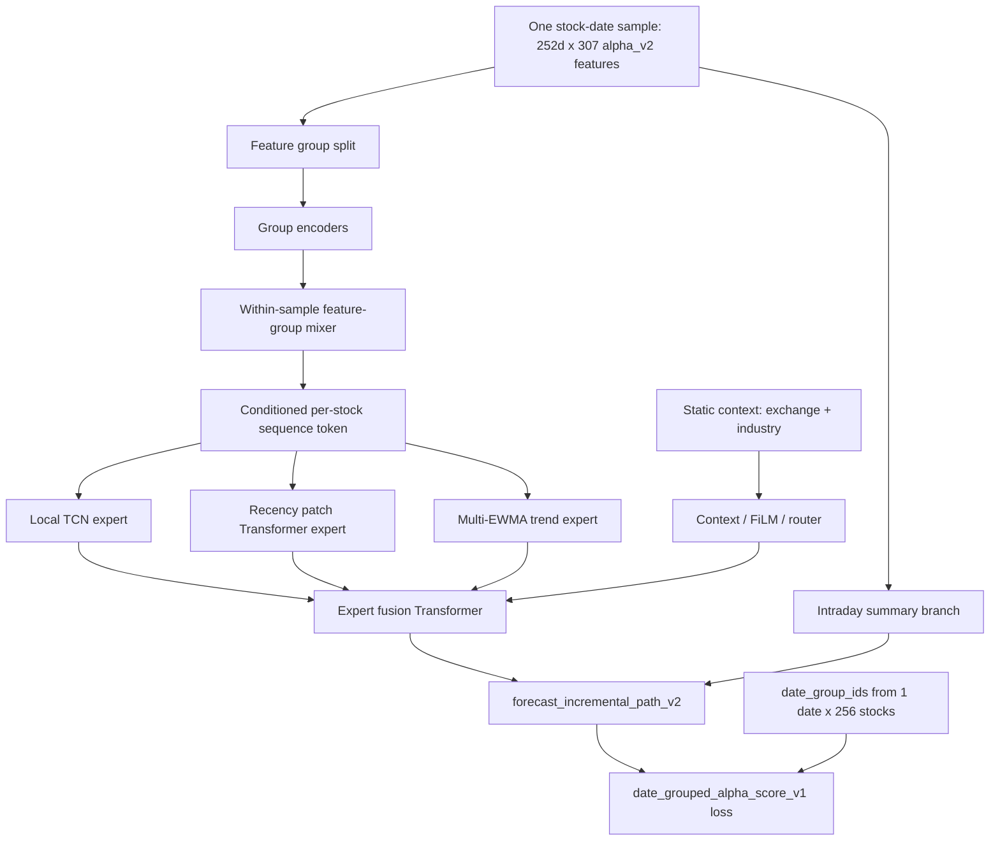

# Path Policy Alpha V2 Date-Slate Alpha Fusion H192 Full Result 20260623

## Verdict

- Status: `completed / research_only / shadow_only / forecast_promising_but_not_anchor_replacement`.
- Date: `2026-06-23`.
- Run tag: `qdp_alpha_v2_date_slate_alpha_fusion_v1_h192_1x256_amp_w2_full_e6_20260622_01`.
- Study root: `daily_research/output/path_policy/studies/qdp_alpha_v2_date_slate_alpha_fusion_v1_h192_1x256_amp_w2_full_e6_20260622_01`.
- Active artifact impact: none. No `daily_research/output/active_execution_strategy.json`, live/default, paper/live/broker, score-backtest bridge, candidate matrix, execution-candidate state, or QDP registry active pointer was changed.

## Contract

```text
data:
  QDP alpha_v2 label_v2 date-slate training pack
  manifest: quant_data_platform/data/memmap/training_pack/mainboard_style_structural_alpha_v2_label_v2_date_slate_pack_20260621_01/qdp_date_slate_training_pack_manifest.json
  train: 2012-2023, 6,050,268 rows, 2,894 train dates
  validation: 2024, 681,979 rows, 221 dates
  test: 2025, 689,467 rows, 222 dates

model:
  family: date_slate_alpha_fusion_v1
  hidden_dim: 192
  transformer_layers: 4
  transformer_heads: 4
  patch_sizes: 4,20
  static_context: exchange,industry
  symbol_id: disabled
  output_profile: forecast_incremental_path_v2

loss:
  profile: date_grouped_alpha_score_v1
  selection_profile: validation_loss
  path_daily: 0.60
  quantile: 0.18
  path_aux: 0.25
  risk_aux: 0.06
  date_grouped_rank: 1.20
  unit_time_alpha_rank: 0.70
  downside_rank_aux: 0.010
  upside_rank_aux: 0.006
  decision_utility / execution cost / topK execution alignment: 0

batching:
  dates_per_batch: 1
  stocks_per_date: 256
  AMP: enabled
  dataloader_num_workers: 2
  per_epoch_prediction_metrics: disabled
```

## Model Semantics Check

This run uses `date_slate_alpha_fusion_v1`, not `date_slate_cross_stock_alpha_fusion_v1`.



Important boundary:

```text
date_group_ids affect the grouped rank loss.
date_group_ids do not enter date_slate_alpha_fusion_v1 forward().
Therefore this run is a per-stock alpha predictor with same-date sampled-chunk ranking supervision.
It is not model-level cross-stock attention, and it is not full-market listwise training.
```

The run summary contains generic date-slate semantics fields such as `sampled_same_date_chunk` and `train_predict_scope_mismatch`. These are material: training rank groups cover same-date chunks of up to 256 stocks, while final prediction/evaluation ranks full validation/test dates from model scores. This is acceptable for the current alpha-score route, but it must not be described as strict full-market top-K optimization.

## Learning Curve

The model early-stopped after epoch 5 because validation loss did not improve after epoch 2.

| epoch | train loss | validation loss | best | patience | train samples/s |
|---:|---:|---:|---|---:|---:|
| 1 | 2.072870 | 2.638775 | yes | 0 | 292.48 |
| 2 | 1.981164 | 2.581296 | yes | 0 | 295.26 |
| 3 | 1.927975 | 2.633971 | no | 1 | 291.79 |
| 4 | 1.888054 | 2.636327 | no | 2 | 293.15 |
| 5 | 1.855626 | 2.653066 | no | 3 | 290.55 |

Best checkpoint by training contract:

```text
best_epoch: 2
best_validation_loss: 2.581295762991109
stopped_reason: early_stopping_patience_exhausted
```

Interpretation: train loss continues to decline after epoch 2, but validation loss worsens. This repeats the generalization pattern seen in prior alpha_v2 full runs and supports validation-loss checkpoint selection for this contract.

## Forecast Metrics

Best checkpoint validation metrics:

| horizon | rank IC | top-bottom spread | direction accuracy |
|---:|---:|---:|---:|
| 1d | 0.055523 | 0.002702 | 0.517148 |
| 3d | 0.062708 | 0.005281 | 0.518547 |
| 5d | 0.071451 | 0.007558 | 0.528252 |
| 10d | 0.081874 | 0.012309 | 0.536905 |
| 20d | 0.088489 | 0.023115 | 0.555973 |

Best checkpoint test metrics:

| horizon | rank IC | top-bottom spread | direction accuracy |
|---:|---:|---:|---:|
| 1d | 0.073454 | 0.002690 | 0.528587 |
| 3d | 0.093674 | 0.006959 | 0.529513 |
| 5d | 0.098348 | 0.009260 | 0.526498 |
| 10d | 0.107750 | 0.014636 | 0.521966 |
| 20d | 0.101403 | 0.019758 | 0.505620 |

The run is forecast-promising because validation/test rank IC and spread are positive across horizons. It is not obviously stronger than the current single-seed anchor because validation rank/spread are below the stronger no-symbol h256 alpha-score run, and personal top-K same-candidate transfer is weaker than the 2026-06-16 anchor.

## Personal Top-K Diagnostic

Diagnostic command used existing `personal_topk_v1`; it is evaluation-only, not checkpoint selection and not a backtest.

Validation-selected candidate:

```text
score_column: pred_aux_cum_3d
top_k: 1
horizon: 20
personal_selection_score: 383.9521
validation net_mean: 4.73%
validation hit_rate_mean: 59.73%
validation positive_month_rate: 75.00%
validation worst_month_mean: -8.79%
```

Same candidate on test:

```text
score_column: pred_aux_cum_3d
top_k: 1
horizon: 20
test net_mean: 1.93%
test hit_rate_mean: 54.95%
test positive_month_rate: 58.33%
test worst_month: 2025-12
test worst_month_mean: -24.77%
test personal_selection_score: -670.37
```

Test-only diagnostic selected:

```text
score_column: pred_aux_cum_5d
top_k: 5
horizon: 5
test-only personal_selection_score: 187.3042
test-only net_mean: 1.40%
test-only positive_month_rate: 75.00%
```

Interpretation:

```text
Validation personal top-K looks very strong, but the same candidate transfers poorly to test because 2025-12 is a severe bad month.
This run does not replace the current anchor qdp_alpha_v2_hybrid_topn_h256_t4_b512_full_e12_20260616_01,
whose validation-selected same-candidate test net was about 2.73%.
```

## Artifacts

```text
forecast_learning_curve.csv
forecast_model_date_slate_alpha_fusion_v1_seed7_best.pt
forecast_model_date_slate_alpha_fusion_v1_seed7_last.pt
forecast_predictions_validation.csv
forecast_predictions_test.csv
forecast_training_summary.json
forecast_walkforward_summary.json
study_summary.json
personal_topk_validation/personal_topk_report.json
personal_topk_test/personal_topk_report.json
```

## Next Action

Do not proceed to multi-seed, score-backtest bridge, candidate matrix, execution-candidate review, paper/live/broker, or active/default changes from this evidence.

Recommended next research step:

```text
analyze why 2025-12 crushes the validation-selected pred_aux_cum_3d top1 h20 candidate;
compare with no-symbol h256 alpha-score and 2026-06-16 topn anchor by month, horizon, and score column;
then decide whether to refine sampled same-date rank loss, month robustness, or return to hybrid alpha-score path.
```

## Verification

Fresh evidence collected:

```text
forecast_progress.json: status completed, phase completed
forecast_learning_curve.csv: epochs 1-5 written
forecast_training_summary.json: status completed
forecast_walkforward_summary.json: status completed
study_summary.json: status completed
personal_topk validation/test diagnostics completed
```

